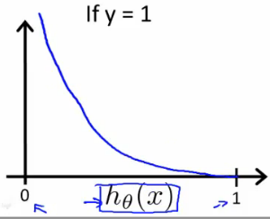
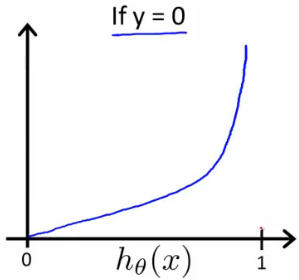

# Cost Function

-------------

####Linear Regression Cost Function
$J(\theta)= \frac{1}{m} \sum_{i=0}^m \frac{1}{2}(h_\theta(x)-y)^2$

$Cost(h_\theta(x),y) = \frac{1}{2} (h_\theta(x) - y)^2$

$h_\theta(x) = \frac{1}{1+\mathrm{e}^{-\theta x}}$ \ : \ sigmoid(logistic) functin

In sigmoid function, Cost function will be __non-convex__.  
we want convex cost function

#### Logistic Regression Cost Function
\[J(\theta)= \frac{1}{m} \sum_{i=1}^m Cost(h_\theta(x^{(i)}),y{(i)})\\
\[Cost(h_\theta(x),y) =
    \begin{cases}
        -\log(h_\theta(x)) &(if \  y = 1) \\
        -log(1 - h_\theta(x)) & (if \  y = 0)
    \end{cases}
\]

 
 
$Cost = 0 \ if \ y = 1, h_\theta(x) = 1$  
$But \ as \ h_\theta(x) \to 0, \ Cost \to \infty$  

- Capture intuition that if $h_\theta(x) = 0$, (predict P($y=1|x;\theta$) = 0)  
but y = 1 we'll penalize learning algorithm by a very Cost

$Cost = 0 \ if \ y = 0, h_\theta(x) = 0$  
$But \ as \ h_\theta(x) \to 1, \ Cost \to \infty$  
 

- Writing the cost function in this way guarantees that J($\theta$) is convex for logistic regression
